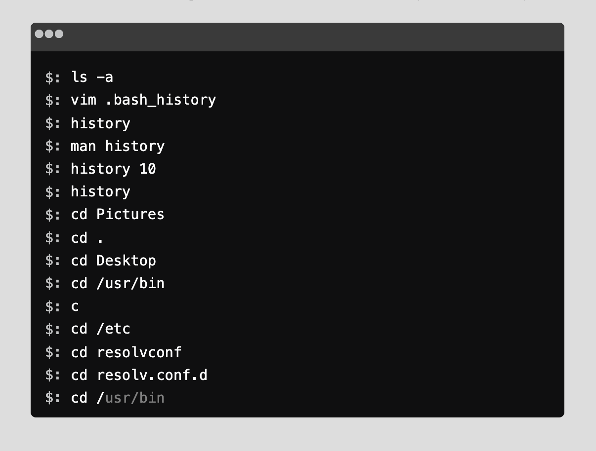

# Autocompleting Terminal - Angular
A small project in Angular showcasing an autocompleting terminal that uses a Trie to suggest a word match using the history of the terminal.

## Demo
</img>

http://malfusion.github.io/autocomplete-terminal
